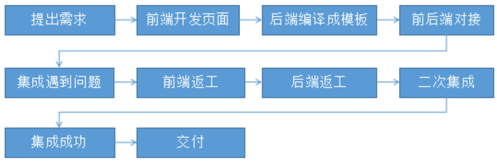
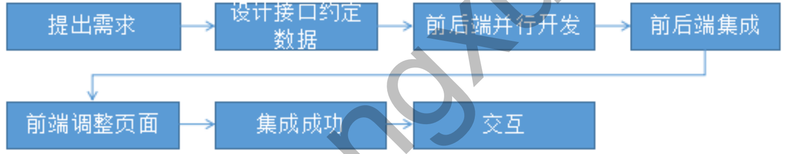

@[toc](前后端分离开发概念)

# 什么是前后端分离开发
## 传统系统架构

1. 前端工程师负责编写HTML页面，完成前端页面设计
2. 后端工程师使用模板技术将HTML页面代码转换为JSP页面，同时内嵌后端代码（如 Java）；前后端强依赖，后端必须要等前端的HTML开发好才能转换为JSP，如果需求变更，前端HTML要更改 ，后端JSP也要跟着变，开发效率低
3. 产品交付的时候，要将前后端代码打包，部署到同一服务器上，或者进行简单的静态分离部署

## 前后端分离架构

1. 前后端约定好API接口&数据&参数
2. 前端工程师只需要编写HTM页面，通过HTTP请求调用后端提供的接口服务即可，后端只要开发接口就行了。无强依赖，如果需求变更,只要接口和参数不变，就不用两边都修改代码，开发效率高。
3. 除了开发阶段分离、在运行期前后端资源也会进行分离部署

# 分析RESTful架构风格
&emsp;&emsp;RESTful架构是通过HTTP请求方式（GET/POST/PUT/DELETE...）来区分对资源CRUD操作，请求资源URL是 *__/资源名称/资源标识__*

## 接口定义方式

功能 | 传统 |  RESTful  
-|-|-
列表查询 | getMemberList | member/list---GET |
查询 | getMember?id=xxx | member/{id}---GET |
添加 | addMember?xxx | member---POST |
修改 | updatemember?id=xxx | member/{id}---PUT |
删除 | deleteMember?id=xxx | member/{id}---DELETE |

## 项目使用RESTful架构风格

项目功能 | 请求URL |  请求方式  
-|-|-
查询所有会员 | member/list | GET |
查询某位会员信息 | member/{id} | GET |
添加会员 | member | POST |
前往修改页面（查出会员信息进行回显） | member/{id} | GET |
修改会员 | member/{id} | PUT |
删除会员 | member/{id} | DELETE |