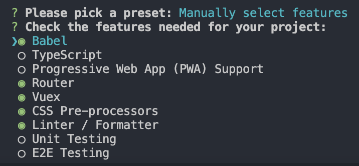

@[toc](项目实战---会员管理系统)

# 项目环境搭建
&emsp;&emsp;首先通过vue的命令创建项目，根据自己的需要选择配置项，这里的配置项如下：



## 路由配置相关

1. 新建 *__src/router/routes.js__* 文件，该文件用来封装路由配置列表，内容如下：

```javascript
// src/router/routes.js 

const routes = [
    {
      path: '/',
      name: 'Home',
      // @代表src目录
      component: () => import('@/views/Home.vue')
    },
    {
      path: '/about',
      name: 'About',
      component: () => import('@/views/About.vue')
    }
  ]

  export default routes
```

&emsp;&emsp;后面所有的路由配置都写在这个文件中。

2. 修改 *__src/router/index.js__* 文件，导入刚才的路由配置表的文件，并在添加到路由对象中：

```javascript
// src/router/index.js

import Vue from 'vue'
import VueRouter from 'vue-router'
// 导入路由列表对象
import routes from './routes'

Vue.use(VueRouter)

const router = new VueRouter({
  mode: 'history',
  base: process.env.BASE_URL,
  // 引入路由列表对象
  routes
})

export default router
```