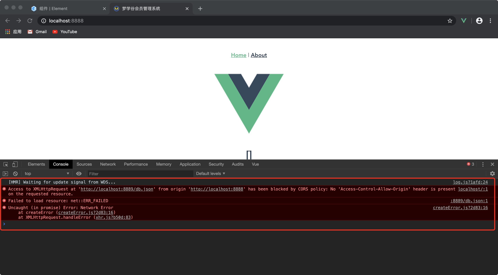

@[toc](Axios功能封装和解决跨域问题)

# 跨域问题
## 什么是跨域
&emsp;&emsp;前后端分离的时候，前端和后端API服务器可能不在同一台主机上，就存在跨域问题，浏览器限制了跨域访问。

&emsp;&emsp;同源策略：指协议、域名、端口号都要相同，其中有一个不同就会产生跨域问题。



&emsp;&emsp;跨域解决：

+ 通过代理请求的方式解决，将API请求通过代理服务器请求到API服务器
+ 开发环境中，在vue.config.js文件中使用devServer.proxy选项进行代理配置

# 方法一

1. 下载 axios

```shell
npm install axios -S
```

2. 创建 *__src/config/index.js__* 文件，在该文件中配置axios的基础路径：

```javascript
// 根据当前环境的不同配置跨域访问的基础路径
export const CFG_BASE_URL 
= process.env.NODE_ENV === 'production' ?
'http://production.com' : 
'http://localhost:5000'
```

3. 新建 *__src/lib/HttpRequest.js__* 文件，在该文件中封装自己的Axios

```javascript
// 引入axios
import axios from 'axios'
// 引入config中基础路径
import { CFG_BASE_URL } from '@/config'

// 创建封装的对象
class HttpRequest {
    // 构造函数
    constructor (baseurl = CFG_BASE_URL){
        this._baseUrl = baseurl
    }

    // 创建全局拦截器
    interceptors (instance) {
        // 请求拦截器
        instance.interceptors.request.use(
            config => {
                return config
            },
            error => {
                return Promise.reject(error)
            }
        )

        // 响应拦截器
        instance.interceptors.request.use(
            response => {
                return response
            },
            error => {
                return Promise.reject(error)
            }
        )
    }

    // 创建默认的配置项
    insideOptions () {
        return {
            baseURL : this._baseUrl
        }
    }

    // 创建请求
    // 参数： 1. options : 配置项
    // 返回值：Promise对象
    request (options) {
        // 创建axios对象
        const instance = axios.create()

        // 合并用户的配置和默认的配置
        options = Object.assign(this.insideOptions(), options)

        // 创建拦截器
        this.interceptors(instance)

        // 返回结果
        return instance(options)
    }
}

export default HttpRequest
```

3. 新建 *__src/api__* 目录（接口目录），项目的ajax请求都可以写在这个目录里面，作统一的管理

4. 新建一个 *__src/api/index.js__* 文件，用来创建封装好的axios类的实例

```javascript
// 导入封装好的axios对象
import HttpRequest from '../lib/HttpRequst'

export default new HttpRequest()
```

5. 新建一个 *__src/api/member.js__* （可以根据项目业务需求创建自己的api文件，这里的member.js是当前用来测试用的）实现具体的业务逻辑：

```javascript
// 导入封装好的axios实例
import axiosApi from '@/api'

export default {
    // 获取 member list
    getList () {
        // 向服务器发送get请求
        return axiosApi.request({
            method: 'get',
            url: '/member/list'
        })
    }
}
```

6. 在页面组件（.vue）中调用，比如下面的调用：

```html
<template>
  <div class="home">
    <button @click="handleClick">发送请求</button>
    {{list}}
  </div>
</template>

<script>
// 导入刚才编写好的api
import memberApi from '@/api/member'
export default {
  data() {
    return {
      list: []
    }
  },
  methods: {
    handleClick () {
      // 调用接口的方法
      memberApi.getList().then(response => {
        const resp = response.data
        if (resp.flag) {
          this.list = resp.data
        }
      })
    }
  },
}
</script>
```

> *__注意：要想获得具体的数据，需要后台服务，或者通过mockjs来模拟数据__*

# 方法二

1. 不同环境变量配置和跨域代理配置重构

&emsp;&emsp;开发环境请求Mock.js获取数据，生产环境请求后台接口获取数据，不同环境请求的URL不一样，所以要为不同环境匹配不同请求接口URL，通过路径前缀进行匹配。

+ 根目录中创建 .env.development和.env.production文件

  + .env.development

```shell
# 目标服务接口地址
VUE_APP_SERVICE_URL = 'http://localhost:5000'

# 开发环境前缀
VUE_APP_BASE_API = '/dev-api'
```

  + .env.production

```shell
# 生产环境前缀
VUE_APP_BASE_API = '/pro-api'
```

> *__注意：只有以VUE_APP开头的变量会被webpackPlugin静态嵌入到客户端的包中__*

2. 在vue.config.js文件中使用devServer.porxy选项进行代理配置

```javascript
module.exports = {
    devServer: {
        port: 8888,// 端口号
        host:'localhost', // 主机
        https: false, // 协议
        open: true,// 启动服务的时候自动打开浏览器访问
        proxy: { // 开发环境代理配置
            // 如果是 /dev-api这个开头就交给代理
            [process.env.VUE_APP_BASE_API] : {
                // 目标服务器地址
                target: process.env.VUE_APP_SERVICE_URL,
                // 开启代理服务器
                changeOrigin: true,
                // 访问页面的时候不需要加上/dev-api
                pathRewrite: {
                    ['^' + process.env.VUE_APP_BASE_API]: ''
                }
            }
        }
    },

    lintOnSave: false, // 关闭格式检查
    productionSourceMap: false, //打包的时候不会生成.map文件，加快打包速度
}
```

3. 新建 *__src/lib/request.js__*

```javascript
// 导入axios
import axios from 'axios'

// 创建axios对象,传入一个对象
const request = axios.create({
    baseURL: process.env.VUE_APP_BASE_API,  // 默认就是 / , 基础路径
    timeout: 5000, //超时时间，毫秒
})

// 创建拦截器
// 请求拦截器
request.interceptors.request.use(config => {
    return config
}, error => {
    // 出现异常
    return Promise.reject(error)
})

// 响应拦截器
request.interceptors.response.use(response => {
    return response
}, error => {
    return Promise.reject(error)
}) 


export default request  // 导出自定义创建的对象
```

4. 修改 *__src/api/member.js__* 文件，使用第二种方式调用：

```javascript
// 导入封装好的axios对象
import request from '@/lib/request.js'

// 导出对象
export default {
    getList() {
        return request({
            method: 'get',
            url:'/member/list'
        })
    }
}
```

> *__注意：要想获得具体的数据，需要后台服务，或者通过mockjs来模拟数据__*