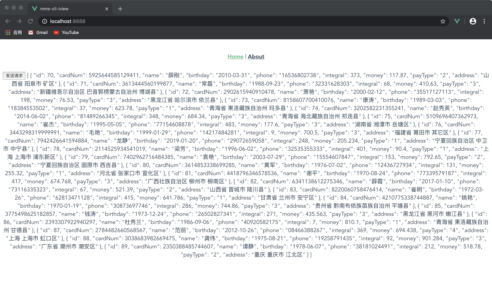

@[toc](MockJS配置)

>*__注意：在开始该配置前，把上一个步骤的axios封装的第二种方法所做的操作全部删除，就使用第一种方法。__*

# MockJS简介
&emsp;&emsp;Mock.js是用于生成随机数据，拦截Ajax请求。通过拦截Ajax请求，根据数据模板生成并返回模拟数据，让前端开发人员独立于后端进行开发，帮助编写单元测试。

# 配置步骤

1. 下载Mock.js，因为Mock.js只是在开发的时候才用到，所以下载到开发依赖下：

```shell
npm install mockjs -D
```

2. 新建 *__src/mock__* 目录，用来存放mock相关的功能

3. 新建 *__src/mock/index.js__* 文件，用来引入Mock.js

```javascript
// 引入Mock
import Mock from 'mockjs'

// 导出Mock
export default Mock
```

4. 在main.js中引入，只有在开发环境中才需要

```javascript
import Vue from 'vue'
import App from './App.vue'
import router from './router'
import store from './store'

// 开发环境下引入Mock
if (process.env.NODE_ENV === 'development') {
  require('@/mock')
}

Vue.config.productionTip = 
process.env.NODE_ENV === 'production';

new Vue({
  router,
  store,
  render: h => h(App)
}).$mount('#app')
```

5. 编写具体的业务逻辑接口，这里编写一个member.js的案例，新建一个 *__src/mock/member.js__*

```javascript
export default {
    getList(){
        return {
            "code": 2000,
            "flag": true,
            "message": "查询成功",
            "data|20": [{
              "id|+1": 10,
              "cardNum": "@integer(10000)",
              "name": "@cname",
              "birthday": "@date",
              "phone|11": "@integer(0,9)",
              "integral": "@integer(0,500)",
              "money": "@float(0,1000,1,3)",
              "payType|1": ['1', '2', '3', '4'],
              "address": '@county(true)'
            }]
        }
    }
}
```

6. 在 *__src/mock/index.js__* 添加Mock拦截：

```javascript
// 引入Mock
import Mock from 'mockjs'
// 导出config
import {CFG_BASE_URL} from '@/config'
// 导出Member的操作
import member from './member'

// 获取 member list
Mock.mock(`${CFG_BASE_URL}/member/list` 
, 'get' , member.getList())

// 导出Mock
export default Mock
```

&emsp;&emsp;然后通过 *__npm run serve__* 运行程序，打开程序，点击按钮就可以看到结果了： 


